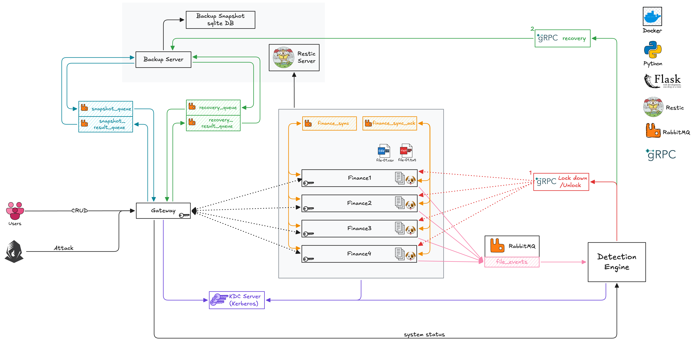

# Distributed Systems Course Project: Anti-Ransomware

## Introduction

<p align="center">Anti-ransomware for Distributed File Storage <br> Constructed with<br><br>
    
    
    
    
    
    
</p>

**key words**: Distributed File Systems, Ransomware Detection, Automated Recovery, Zero-Trust Architecture.


While **distributed, active-active file systems** ensure high data availability and load balancing, they inevitably facilitate the rapid propagation of **ransomware**. Malicious encryptions exploit decentralized synchronization mechanisms, rapidly replicating corrupted files across healthy peers. To mitigate this critical vulnerability, this project presents a resilient peer-to-peer distributed storage architecture that integrates real-time ransomware detection with automated recovery. The proposed system employs a **centralized gateway** to route user requests across **equal-privilege storage replicas**, utilizing asynchronous message queues and vector clocks to manage **concurrent writes** and resolve synchronization conflicts. Furthermore, a zero-trust network topology is strictly enforced via **key distribution based authentication**. For proactive defense, local **watchdog** processes continuously monitor file I/O behaviors on the storage nodes,  streaming file operations to a centralized **detection engine**. Upon identifying encryption anomalies, the engine executes a low-latency **remote procedure call** to quickly separate the compromised node from the healthy ones. Subsequently, an automated **recovery service** utilizes periodic **snapshots** to restore the compromised node to a pre-attack state. This architecture demonstrates the ability to resolve synchronization conflicts and recover from ransomware infections autonomously and transparently, thereby ensuring high availability and minimizing operational downtime.

## Architecture




The key components of the system are listed as below:
1. **Routing and Load Balancing**: A gateway acts as the main entry point, randomly distributing user file requests (read or write) across four storage nodes to balance the workload.
2. **Peer-to-Peer Storage and Sync**: The storage cluster consists of four equal-privilege client nodes, each holding a full replica of the file system. The nodes synchronize the updated data asynchronously using a message queue.
3. **Active Ransomware Detection**: A watchdog process on each client node monitors local file operations and streams these events to a centralized detection engine, which runs the evaluation logic to identify ransomware behaviors (such as rapid mass file encryption).
4. **Lockdown and Automated Recovery**: If an attack is confirmed, the detection engine immediately issues a lockdown command to avoid further loss. A recovery service then takes over, coordinating with a backup storage server to overwrite the corrupted files with a clean snapshot.
5. **Authentication**: Components involved in HTTP communication in the system are strictly authenticated through a centralized key distribution server to prevent unauthorized internal requests.
## Deployment

### Via Docker

It's recommended that you use docker to run this project.

We have an configured docker compose, in project root, please run

```shell
docker-compose up --build
```

### Run Nodes Separately

> [!IMPORTANT]
>
> We use , other versions might not be supported

If you want to run each component locally, first, you need to install all the needed packages via

```shell
pip install -r requirements.txt
```

And to compile protobuf files:

```cmd
python -m grpc_tools.protoc \
  -I./proto \
  --python_out=./common \
  --grpc_python_out=./common \
  ./proto/lockdown.proto
```

## Other Info

- See gateway interfaces here: http://127.0.0.1:9000/apidocs/
- See client (storage nodes) interfaces here (the interfaces won't be callable because user visiting from a browser lack the authentication to directly access the storage nodes, operate via gateway please): http://127.0.0.1:5001/apidocs/
- Browse the files stored in the system through gateway here: http://127.0.0.1:9000/browse
- See the deprecated dashboard here: http://127.0.0.1:8501/

## Project Details

See [<b>detail.md</b>](docs/detail.md) for more information